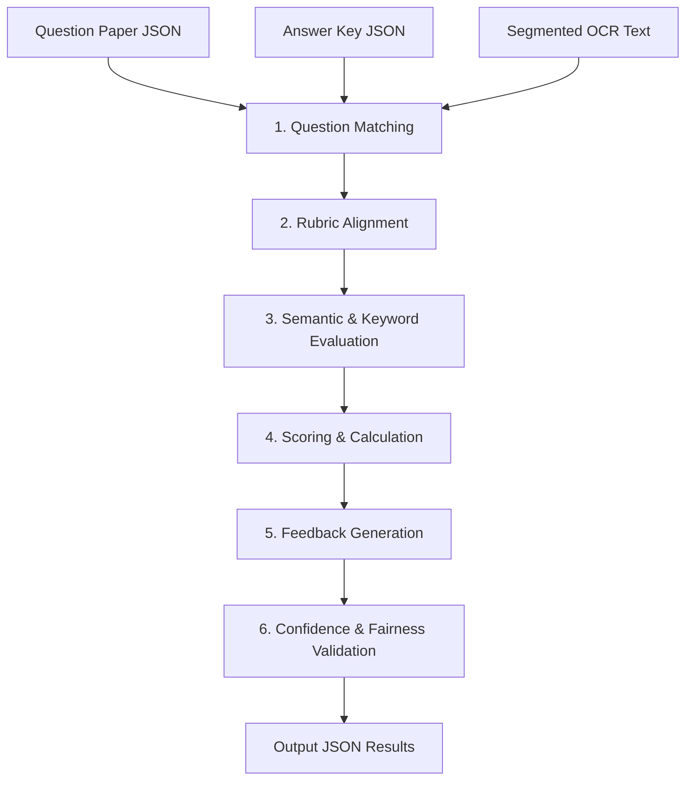

# GradeMIND AI Evaluation Engine

This document outlines the architecture, pipeline, and methodology of the AI evaluation engine that grades handwritten answers against reference keys.

---

## Evaluation Workflow

The evaluation engine takes segmented OCR text and grades it against the question paper context and marking guidelines.

---

## Processing Steps

### 1. Question Matching
Aligns each segmented student answer block with its corresponding question text and answer key. It uses regex and vector search to map labeled answers (e.g. "Ans 1(b)") to reference keys.

### 2. Rubric Alignment
Maps the grading criteria to steps. For instance:
- State formula: 2 marks.
- Correct calculation: 2 marks.
- Correct units: 1 mark.

### 3. Semantic & Keyword Evaluation
Combines semantic similarity (contextual embeddings) with lexical overlap (keyword matching) to check if the student expressed the correct concept, regardless of their wording.

### 4. Scoring & Calculation
Calculates the final score for the question by summing the marks awarded for each rubric criteria. It ensures the score does not exceed the question's maximum allowed marks.

### 5. Feedback Generation
Drafts constructive feedback detailing why marks were awarded or deducted, citing the exact grading criteria that were or were not met.

### 6. Confidence & Fairness Validation
- **Confidence Score**: Compares LLM output parsed parameters against rubric constraints. Discrepancies drop confidence below `0.70`, flagging the submission for teacher review.
- **Anonymization**: Submissions are anonymized (student IDs and names are removed) before evaluation to prevent grading bias.

---

## Evaluation Methodologies

### Rubric Evaluation
A rule-based evaluation that grades responses step-by-step. The LLM acts as a criteria matching engine, assessing whether the student's answer fulfills the required steps of the rubric.

### Keyword Evaluation
Checks for critical terms (e.g., "chloroplast", "mitosis", "photosynthesis") required by the answer key. This is done using exact matching and lemmatization (word normalizations).

### Semantic Evaluation
Uses contextual embeddings and LLMs to evaluate conceptual understanding. If a student uses a synonym or alternative explanation (e.g., "cellular powerhouse" instead of "source of cell energy"), the engine recognizes it as correct.

---

## Fairness Layer

The Fairness Layer is a set of prompt engineering guidelines designed to ensure objective grading:
1. **Name Anonymization**: All student identifier details are removed from the payload before sending it to the evaluation model.
2. **Neatness Neutrality**: The system ignores handwriting style, formatting irregularities, or cross-outs, focusing purely on content correctness.
3. **No Halos**: Each question is graded independently to prevent grading bias from previous answers.
4. **Adherence to Rubric**: The model is prohibited from awarding extra credit or penalizing students for details not specified in the marking criteria.
