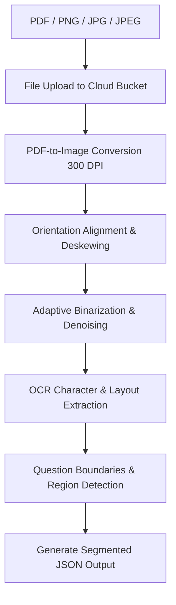

# GradeMIND OCR Pipeline Design

This document details the optical character recognition (OCR) and document preprocessing pipeline used to transform handwritten answer sheets into structured text segments for AI evaluation.

---

## OCR Processing Workflow

The OCR pipeline processes raw image files or multi-page PDFs to generate structured question-level text segments.

### Pipeline Details

1. **Upload**: Files are stored in secure cloud storage. PDFs are processed via background worker queues.
2. **Preprocessing**:
   - **PDF Conversion**: Converts pages to 300 DPI PNG images using `pdf2image`.
   - **Deskewing**: Uses Hough transform line detection to calculate rotation angle and realign tilted pages.
   - **Denoising**: Applies bilateral filtering to remove page creases and shadows while retaining ink strokes.
   - **Adaptive Thresholding**: Converts color images to binary (black and white) using Otsu's thresholding to enhance handwriting contrast.
3. **OCR Extraction**: Extracts text content and associated 2D bounding boxes (`[x_min, y_min, x_max, y_max]`) to maintain layout coordinates.
4. **Question Segmentation**:
   - Matches structural cues (e.g., Q1, Question 2, numbers inside margins) to identify boundaries.
   - Groups text blocks inside detected boundaries into cohesive answers.
5. **JSON Output**: The output is structured logically per page and question segment.

---

## Comparison of OCR Technologies

| Metric / Feature | Tesseract | EasyOCR | Google Cloud Vision API |
| :--- | :--- | :--- | :--- |
| **License** | Open Source (Apache 2.0) | Open Source (Apache 2.0) | Proprietary (Pay-per-use) |
| **Infrastructure** | Runs locally (CPU bound) | Runs locally (GPU recommended) | Managed Cloud API |
| **Handwriting Accuracy**| Poor (Lacks deep handwriting models) | Moderate (Good on cursive, slow) | **Excellent** (State-of-the-art model) |
| **Skew/Rotation Tolerance**| Low (Fails on rotated pages) | Medium | **High** (Auto-orientation detection) |
| **Layout Analysis** | Basic | Moderate | **Advanced** (Hierarchical blocks) |
| **Cost** | Free ($0) | Free ($0) | ~$1.50 per 1,000 pages |

### Tesseract
- **Pros**: Completely free, offline, highly customizable with training.
- **Cons**: Poor performance on handwriting, requires manual deskewing, layout detection often breaks with multi-column formats.

### EasyOCR
- **Pros**: Good open-source multilingual handwriting support, PyTorch integration.
- **Cons**: High latency on standard CPU instances, requires dedicated GPU instances for acceptable production speeds.

### Google Cloud Vision
- **Pros**: Industry-leading accuracy for complex handwriting, auto-deskewing, detailed block/word-level coordinates, handles poor lighting and wrinkles.
- **Cons**: Requires external internet connection, billing dependencies, potential data privacy configuration requirements.

---

## Final Architecture Recommendation

**Recommendation: Google Cloud Vision API.**

### Rationale
Handwritten exam sheets present significant challenges: varied handwriting, light pencil markings, and angled scans. Google Cloud Vision API provides unmatched handwriting recognition accuracy and robust layout parsing out-of-the-box. This minimizes errors in the subsequent AI evaluation phase, as the evaluation engine requires precise transcriptions. Cost is mitigated by caching OCR output and processing only on new student uploads.
