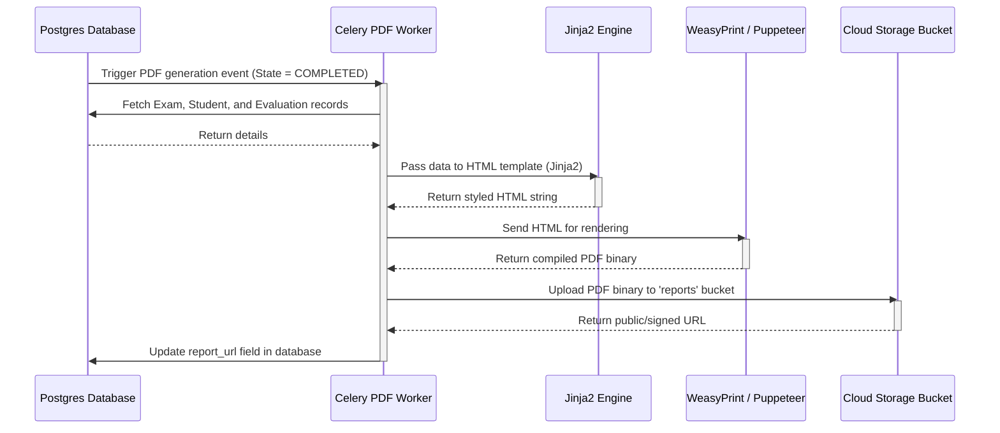

# GradeMIND Report Generation Design

This document details the layout, data structure, and generation workflow of the student evaluation report card PDFs.

---

## Report Structure

The generated PDF report consists of five distinct visual modules:

```
+--------------------------------------------------------+
|                      GRADEMIND                         |
|                 EVALUATION REPORT CARD                 |
+--------------------------------------------------------+
| Student Info: John Doe          Exam: Physics Midterm  |
| Student ID: 2026-PHY-09         Date: June 11, 2026    |
+--------------------------------------------------------+
|                 FINAL SCORE: 82.5 / 100                |
|           Class Average: 71.0   |   Rank: Top 15%      |
+--------------------------------------------------------+
| QUESTION BREAKDOWN                                     |
| Q.No   Max   Awarded   Feedback                        |
| 1a     10.0   8.5      Formula correct. Missed units.  |
| 1b     15.0  14.0      Excellent derivation.           |
| ...                                                    |
+--------------------------------------------------------+
| COHORT ANALYTICS CHART                                 |
| [Histogram of Class Marks showing Student Position]   |
+--------------------------------------------------------+
```

### 1. Header Block
- Brand Logo
- Student Name and unique Student ID
- Course/Exam Title
- Date of Evaluation

### 2. Score Summary Card
- Large bold final score representation (e.g. **85 / 100**).
- Percentile ranking indicator.
- Classification badge (e.g. "Passed", "Honors", "Needs Review").

### 3. Detailed Question breakdown Table
- Columns:
  - **Question ID**: e.g., "1a", "Q2".
  - **Max Marks**: Maximum achievable points.
  - **Score Awarded**: Graded points.
  - **Rubric Criteria Met**: List of satisfied criteria.
  - **AI Justification**: Feedback describing omissions or correct steps.

### 4. Cohort Analytics Graph
- Comparative bar chart comparing the student's score against the class average, median, and maximum scores.

### 5. Sign-off Section
- Teacher's manual override notes (if any).
- Authentication QR code for verifying report validity.

---

## Report Generation Workflow

The workflow converts evaluation database records into PDF files using an asynchronous worker queue.



### Technology Recommendation

- **HTML Template Engine**: `Jinja2` (easy variables mapping).
- **PDF Renderer**: `WeasyPrint` (HTML+CSS to PDF converter) or `Playwright/Puppeteer` (headless chrome PDF printer). Weasyprint is recommended because it supports CSS Paged Media standards (page breaks, page counts, margins).
