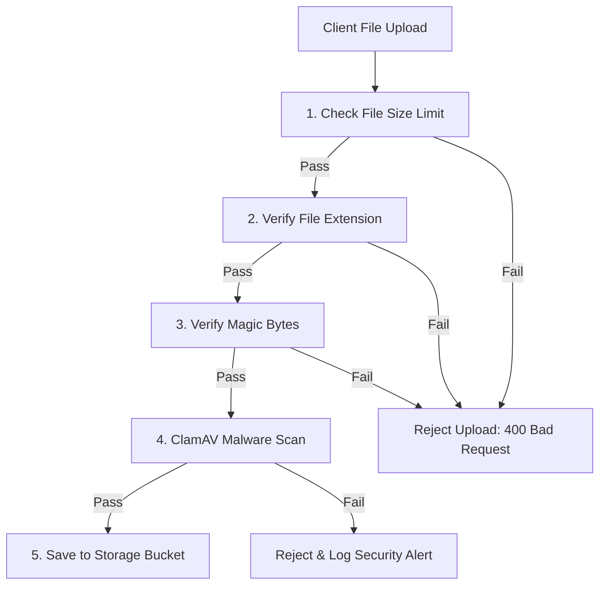

# GradeMIND Storage Architecture

This document defines the storage layout, directory schemas, security policies, and validation processes for files uploaded to and generated by GradeMIND.

---

## Bucket Topographies

GradeMIND uses four distinct cloud storage buckets (e.g., GCS or AWS S3) to isolate assets based on access patterns and sensitivity:

```
GradeMIND Storage System
 ├── [Bucket] question-papers
 ├── [Bucket] answer-keys
 ├── [Bucket] answer-sheets
 └── [Bucket] reports
```

### 1. `question-papers`
- **Purpose**: Reference exam papers uploaded by teachers.
- **Access Pattern**: Read-heavy by students during exams and by the AI evaluation worker.
- **Access Control**: Internal system access, read access allowed for registered teachers.

### 2. `answer-keys`
- **Purpose**: Reference keys and grading rubrics uploaded by teachers.
- **Access Pattern**: Read-only, accessed exclusively by the AI evaluation worker.
- **Access Control**: Strictly private. Never exposed to public HTTP endpoints or student roles.

### 3. `answer-sheets`
- **Purpose**: Scanned student response papers.
- **Access Pattern**: Write-once, read-by OCR pipeline and evaluating AI.
- **Access Control**: Private. Students can only read their own sheets; teachers can read sheets for their exams.

### 4. `reports`
- **Purpose**: Generated PDF evaluation report cards.
- **Access Pattern**: Read-heavy by students and parents.
- **Access Control**: Protected by signed URLs. Exposes grading details only to authorized users.

---

## Directory Structure & Naming Conventions

All buckets structure files hierarchically by `exam_id` to prevent performance bottlenecks.

```
/ (bucket root)
 └── {exam_id}/
      ├── question_paper_{timestamp}.pdf
      ├── answer_key_{timestamp}.json
      ├── submissions/
      │    └── {student_id}_{submission_id}.pdf
      └── reports/
           └── {student_id}_{submission_id}_report.pdf
```

### File Naming Rules
- **Question Paper**: `{exam_id}/question_paper_{timestamp}.{ext}`
- **Answer Key**: `{exam_id}/answer_key_{timestamp}.{ext}`
- **Student Answer Sheet**: `{exam_id}/submissions/{student_id}_{submission_id}.{ext}`
- **Evaluation Report**: `{exam_id}/reports/{student_id}_{submission_id}_report.pdf`

---

## Retention Policy

To manage costs and ensure compliance, the following lifecycle rules are applied:

| Bucket | Active Storage (Hot) | Archive Storage (Cold) | Permanent Deletion |
| :--- | :--- | :--- | :--- |
| `question-papers` | 365 Days | 4 Years (Glacier/Archive) | After 5 Years |
| `answer-keys` | 365 Days | 4 Years (Glacier/Archive) | After 5 Years |
| `answer-sheets` | 90 Days | 2 Years (Glacier/Archive) | After 3 Years (Audit period) |
| `reports` | 365 Days | 2 Years (Glacier/Archive) | After 3 Years |

---

## File Validation Strategy

To prevent malicious uploads or corrupted data, a multi-stage validation is enforced:



1. **Size Limits**:
   - `question-papers`: Max 20 MB.
   - `answer-keys`: Max 10 MB.
   - `answer-sheets`: Max 50 MB.
   - `reports`: Max 5 MB.
2. **Allowed Mime Types**: `application/pdf`, `image/png`, `image/jpeg`.
3. **Magic Byte Verification**: Read the first 2048 bytes of the file stream to verify file headers (e.g., `%PDF-1.` for PDF, `\x89PNG\r\n\x1a\n` for PNG).
