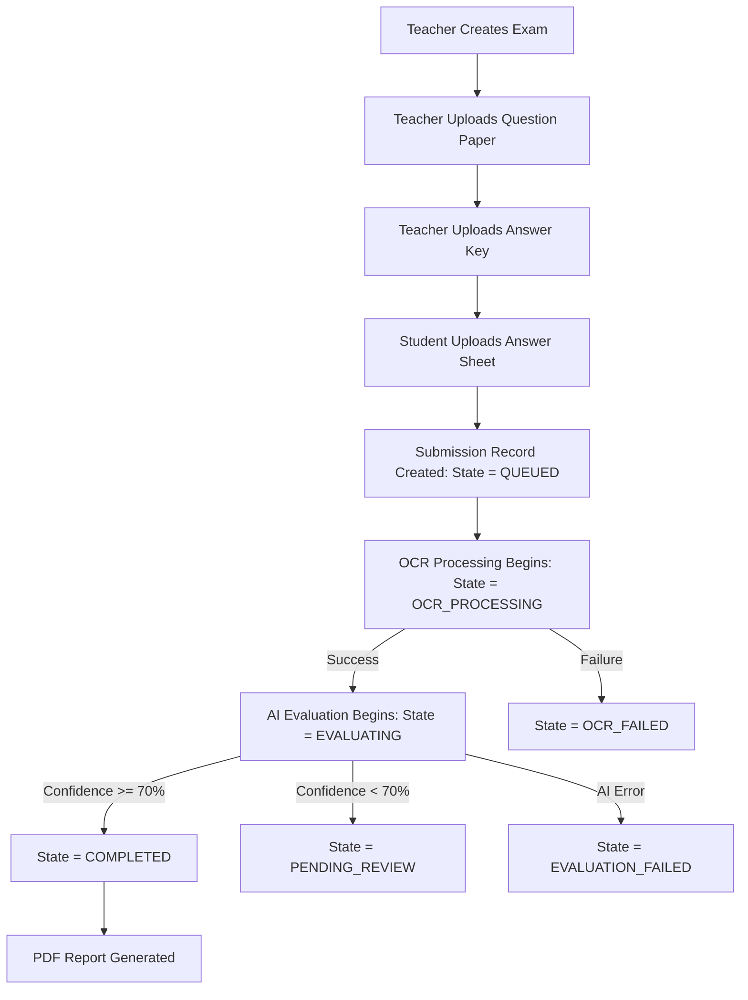
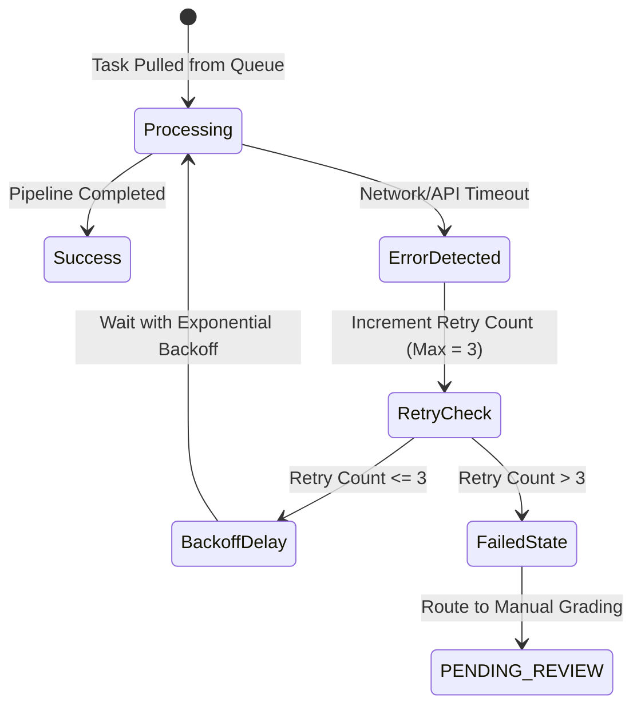

# GradeMIND Submission Design

This document details the lifecycle and processing pipeline of an exam submission, from setup to final grading.

---

## Processing Workflow

Below is the sequential diagram of the exam submission and evaluation workflow:

---

## State machine

| State | Source State | Trigger Condition | Target State on Success | Target State on Failure |
| :--- | :--- | :--- | :--- | :--- |
| **DRAFT** | *None* | Teacher instantiates Exam | **READY** (once assets are uploaded) | N/A |
| **READY** | DRAFT | Upload of both Question Paper & Answer Key | **SUBMITTED** (upon student upload) | N/A |
| **SUBMITTED** | READY | Student uploads answer sheet (stored in bucket) | **OCR_PROCESSING** | **OCR_FAILED** (e.g. invalid file format) |
| **OCR_PROCESSING** | SUBMITTED | Celery/Background task worker starts processing | **EVALUATING** | **OCR_FAILED** (e.g. unreadable scan) |
| **EVALUATING** | OCR_PROCESSING | Text & segmentation JSON loaded to AI Engine | **COMPLETED** (if high confidence) or **PENDING_REVIEW** | **EVALUATION_FAILED** (LLM error) |
| **PENDING_REVIEW** | EVALUATING | Evaluation results generated but confidence is < 0.70 | **COMPLETED** (after teacher manual override) | N/A |
| **COMPLETED** | EVALUATING / PENDING_REVIEW | Grading results saved and report PDF built | N/A | N/A |

---

## Detailed Failure Scenarios & Mitigations

### 1. File Upload Corruptions
- **Scenario**: Uploaded PDF or image is corrupted or truncated.
- **Mitigation**: Perform client-side validation on size/format. Implement synchronous file-header sniffing (using libraries like `python-magic`) in the `/upload` API before returning a `202 Accepted` status.

### 2. Low-Contrast Scan / Failed OCR
- **Scenario**: OCR fails to segment the page or extracts zero legible characters because of extremely poor lighting or pencil markings.
- **Mitigation**:
  - Image preprocessing: convert to grayscale, apply adaptive thresholding, and deskew.
  - If characters retrieved are below threshold (e.g. < 50 characters across 5 pages), move to `OCR_FAILED` and flag as "Poor upload quality, please re-scan".

### 3. LLM API Transient Failures (Rate limits/Timeouts)
- **Scenario**: AI Evaluation API receives a rate limit (HTTP 429) or times out (HTTP 504) during analysis.
- **Mitigation**:
  - Implement a queue-based processing model (e.g. using Celery/RabbitMQ).
  - Use exponential backoff retries with jitter.

---

## Retry Strategy

1. **Retry Mechanism**: The task runner automatically retries transient errors.
2. **Backoff Parameters**:
   - **Base Delay**: 5 seconds
   - **Multiplier**: 2.0 (i.e. retry at 5s, 10s, 20s)
   - **Jitter**: Random +/- 1-2 seconds to prevent thundering herd problem.
3. **Max Retries**: 3 attempts.
4. **Fallback Handler**: If the retries are exhausted, the submission is updated to `EVALUATION_FAILED` or `OCR_FAILED` depending on the phase, and notification is dispatched to the student/teacher. If grading was partially successful, it goes to `PENDING_REVIEW` to allow the teacher to verify what was processed.
