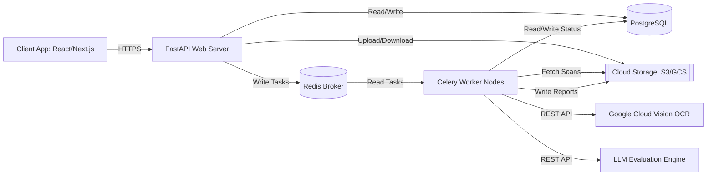
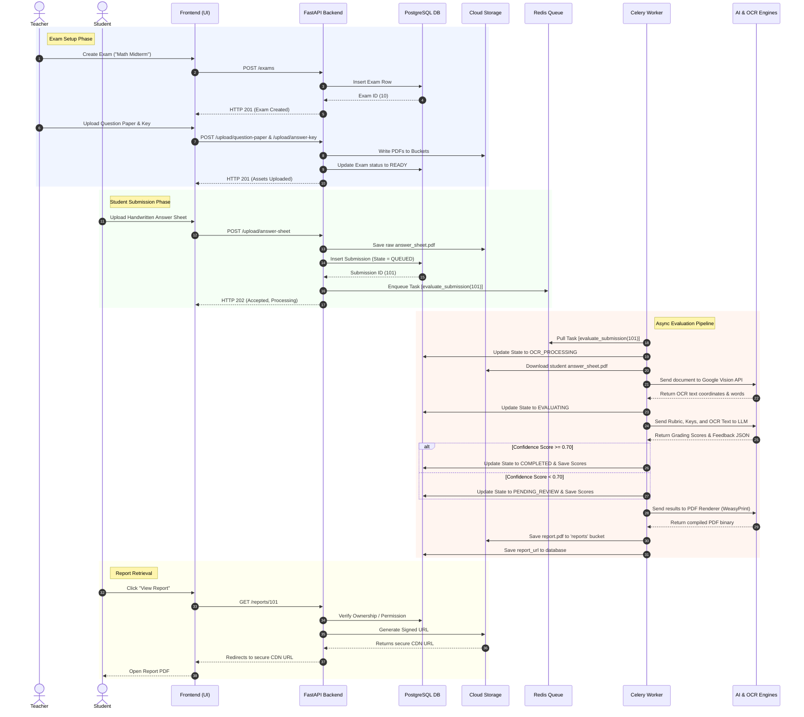
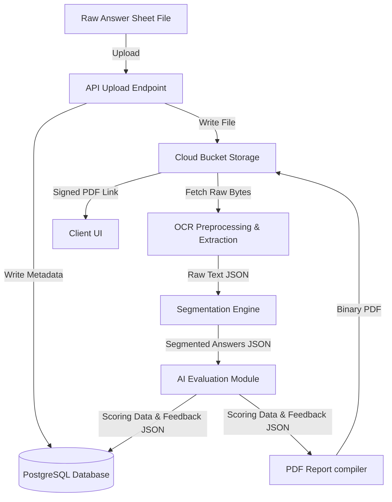

# GradeMIND System Workflow

This document provides a holistic architectural view of GradeMIND, mapping component interactions, data flows, and end-to-end sequences.

---

## Component Interaction Diagram

This diagram displays the structural components of GradeMIND and their communication interfaces:

---

## End-to-End Sequence Diagram

The following sequence diagram details the full lifecycle of an exam from creation to final report download:

---

## Data Flow Diagram (DFD)

This diagram shows how data transforms as it moves through the system layers:

